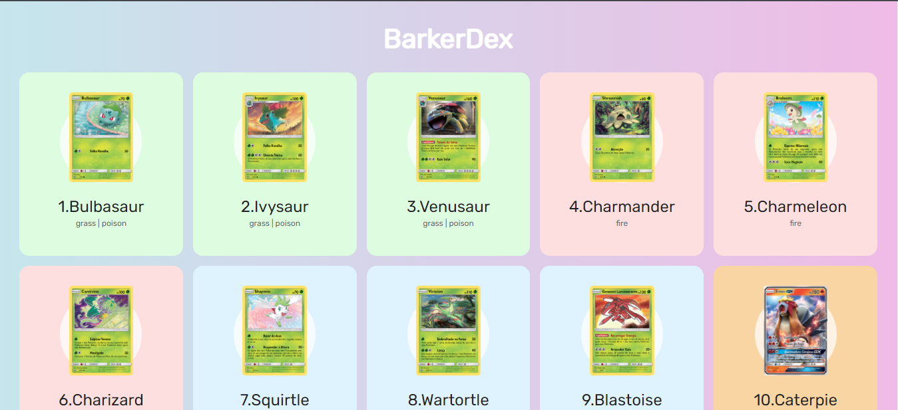

    
 
        <h1><b>barkerDexPokeAPI</b></h1>
    

- ## Implementação básica da API Pokedex, para servir de base em projetos de iniciantes ou para quem não quer "perder" tempo com a API.

- ### *obs: "banco de imagens" do site pokeres.bastionbot.org fora do ar. Troquei o apontamento das imagens para cartas do site Pokemon, afim do site de demonstração não ficar sem imagens.